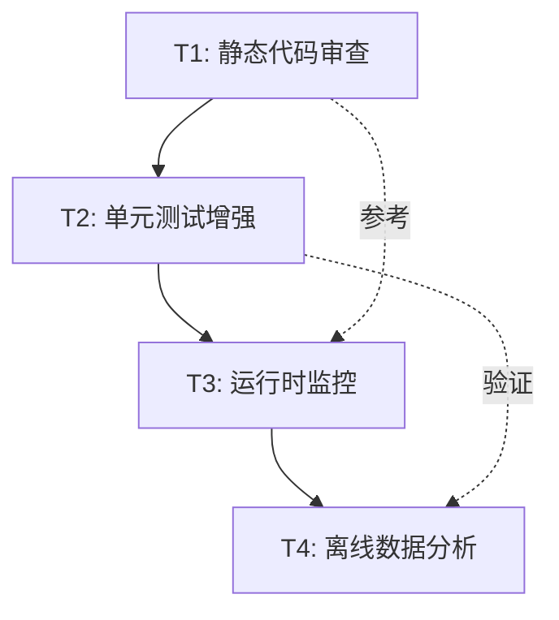

# Mock数据物理规律验证 - 任务分解

**关联文档**: [MOCK_PHYSICS_VALIDATION_PLAN.md](./MOCK_PHYSICS_VALIDATION_PLAN.md)  
**创建日期**: 2026-04-25  
**总工期估算**: 6人日

---

## 任务树结构

```
Mock数据物理规律验证
├── T1: 静态代码审查 (1人日)
│   ├── T1.1: 审查SimulationContext物理公式
│   ├── T1.2: 审查设备计算方法
│   └── T1.3: 边界条件检查
│
├── T2: 单元测试增强 (2人日)
│   ├── T2.1: Mock设备单体测试
│   │   ├── T2.1.1: MockTorqueDevice测试
│   │   ├── T2.1.2: MockMotorDevice测试
│   │   ├── T2.1.3: MockEncoderDevice测试
│   │   └── T2.1.4: MockBrakeDevice测试
│   │
│   └── T2.2: 跨设备集成测试
│       ├── T2.2.1: 转速一致性测试
│       ├── T2.2.2: 功率守恒测试
│       └── T2.2.3: 制动动力学测试
│
├── T3: 运行时监控工具 (2人日)
│   ├── T3.1: PhysicsValidator实现
│   ├── T3.2: GearboxTestEngine集成
│   └── T3.3: 违规日志系统
│
└── T4: 离线数据分析 (1人日)
    ├── T4.1: 遥测数据导出
    ├── T4.2: Python分析脚本
    └── T4.3: 可视化报告生成
```

---

## 详细任务卡片

### 📋 T1: 静态代码审查

**负责角色**: 代码审查 + 头脑风暴  
**工期**: 1人日  
**优先级**: P0

#### T1.1: 审查SimulationContext物理公式
**文件**: `src/infrastructure/simulation/SimulationContext.h`

**检查项**:
- [ ] 角度积分公式: `degreesPerTick = RPM × 6 × 0.01` ✅
- [ ] 加速度限制: `accelRatePerTick = 5.0` (对应500 RPM/s) ✅
- [ ] 制动减速系数: `speedReduction = brakeLoad × 100` (需验证合理性)
- [ ] 目标转速计算: `targetSpeedRpm = dutyCycle × 15` (最大1500 RPM)

**输出**: 代码审查清单 (Markdown)

---

#### T1.2: 审查设备计算方法
**文件**: 
- `src/infrastructure/simulation/SimulatedTorqueDevice.cpp`
- `src/infrastructure/simulation/SimulatedMotorDevice.cpp`

**检查项**:
- [ ] 功率公式: `P = T × RPM × 2π/60` ✅
- [ ] 扭矩组成: `T = 0.3 + motorT + brakeT` ✅
- [ ] 电机电流模型: `I = 0.5 + 1.5×duty + 0.3×brake - 0.2×speed` ✅
- [ ] 制动扭矩系数: `0.85 N·m/A` (需与实际硬件对比)

**输出**: 物理模型参数对比表

---

#### T1.3: 边界条件检查
**检查项**:
- [ ] 角度归一化 (0-360°)
- [ ] 除零保护 (功率计算时转速为0)
- [ ] 数值溢出保护 (累计角度)
- [ ] 负值截断 (电流、扭矩不能为负)

**输出**: 边界条件测试用例列表

---

### 📋 T2: 单元测试增强

**负责角色**: 基础设施/服务开发 + 协议与设备开发  
**工期**: 2人日  
**优先级**: P0

#### T2.1.1: MockTorqueDevice测试
**测试文件**: `tests/simulation/MockTorqueDevicePhysicsTests.cpp`

**测试用例**:
```cpp
TEST(MockTorqueDevice, PowerConservationLaw) {
    // 验证 P = T × ω
    // 误差阈值: 10%
}

TEST(MockTorqueDevice, TorqueComposition) {
    // 验证 T_total = T_friction + T_motor + T_brake
    // 各分量合理性检查
}

TEST(MockTorqueDevice, BrakeTorqueMonotonicity) {
    // 验证制动电流增加 → 扭矩单调递增
}
```

**判据**: 所有测试通过

---

#### T2.1.2: MockMotorDevice测试
**测试文件**: `tests/simulation/MockMotorDevicePhysicsTests.cpp`

**测试用例**:
```cpp
TEST(MockMotorDevice, CurrentLoadRelation) {
    // 验证电流随负载增加
    // 系数验证: ΔI/ΔBrake ≈ 0.3
}

TEST(MockMotorDevice, IdleCurrentLimit) {
    // 空载电流 < 3A
}

TEST(MockMotorDevice, BackEMFEffect) {
    // 高速时电流下降
}
```

---

#### T2.1.3: MockEncoderDevice测试
**测试文件**: `tests/simulation/MockEncoderDevicePhysicsTests.cpp`

**测试用例**:
```cpp
TEST(MockEncoderDevice, AngleIntegrationContinuity) {
    // 验证角度积分连续性
    // 误差阈值: 1°
}

TEST(MockEncoderDevice, ZeroCrossingHandling) {
    // 测试0°/360°边界
}

TEST(MockEncoderDevice, MultiTurnAccumulation) {
    // 多圈累计角度正确性
}
```

---

#### T2.2.1: 跨设备转速一致性测试
**测试文件**: `tests/simulation/CrossDevicePhysicsTests.cpp`

**测试用例**:
```cpp
TEST(CrossDevice, SpeedConsistency) {
    SimulationContext ctx;
    SimulatedTorqueDevice torque(&ctx);
    SimulatedEncoderDevice encoder(&ctx);
    
    ctx.setMotorDirection(Forward);
    ctx.setMotorDutyCycle(50.0);
    
    for (int i = 0; i < 100; i++) {
        ctx.advanceTick();
        
        double torqueSpeed, encoderSpeed;
        torque.readSpeed(torqueSpeed);
        encoderSpeed = std::abs(ctx.encoderAngularVelocityRpm());
        
        double error = std::abs(torqueSpeed - encoderSpeed) / 
                       std::max(torqueSpeed, encoderSpeed);
        
        ASSERT_LT(error, 0.05) << "Speed mismatch at tick " << i;
    }
}
```

---

### 📋 T3: 运行时监控工具

**负责角色**: 领域引擎开发 + ViewModel开发  
**工期**: 2人日  
**优先级**: P1

#### T3.1: PhysicsValidator实现
**新增文件**: 
- `src/infrastructure/validation/PhysicsValidator.h`
- `src/infrastructure/validation/PhysicsValidator.cpp`

**接口设计**:
```cpp
class PhysicsValidator {
public:
    struct ValidationResult {
        bool passed;
        QString ruleName;
        QString message;
        double actualValue;
        double expectedValue;
        double threshold;
    };
    
    static ValidationResult checkPowerConservation(
        const TelemetrySnapshot& snapshot);
    
    static ValidationResult checkSpeedConsistency(
        const TelemetrySnapshot& snapshot);
    
    static ValidationResult checkAccelerationLimit(
        const TelemetrySnapshot& current,
        const TelemetrySnapshot& previous);
    
    static QVector<ValidationResult> validateAll(
        const TelemetrySnapshot& current,
        const TelemetrySnapshot& previous);
};
```

**实现要点**:
- 每个检查方法返回详细的违规信息
- 支持阈值配置
- 线程安全 (使用const方法)

---

#### T3.2: GearboxTestEngine集成
**修改文件**: `src/domain/GearboxTestEngine.cpp`

**集成点**:
```cpp
void GearboxTestEngine::onCycleTick() {
    TelemetrySnapshot snapshot;
    if (!acquireTelemetry(snapshot)) return;
    
    // 物理规律验证
    auto results = PhysicsValidator::validateAll(snapshot, m_lastSnapshot);
    for (const auto& result : results) {
        if (!result.passed) {
            qWarning() << "Physics violation:" << result.ruleName 
                      << result.message;
            // 可选: 触发错误信号
            // emit physicsViolationDetected(result);
        }
    }
    
    m_lastSnapshot = snapshot;
    
    // 原有状态机逻辑...
}
```

**注意事项**:
- 不应阻塞测试流程 (仅记录警告)
- 性能开销 < 1ms/tick

---

#### T3.3: 违规日志系统
**新增文件**: `src/infrastructure/logging/PhysicsViolationLogger.h`

**功能**:
- 记录所有物理规律违规事件
- 输出格式: JSON Lines
- 文件路径: `logs/physics_violations_<timestamp>.jsonl`

**日志示例**:
```json
{"timestamp": "2026-04-25T10:30:45.123", "rule": "PowerConservation", "error": 0.15, "threshold": 0.10, "torque": 2.5, "speed": 500, "power_actual": 130.5, "power_expected": 130.9}
```

---

### 📋 T4: 离线数据分析

**负责角色**: 头脑风暴 + 代码审查  
**工期**: 1人日  
**优先级**: P2

#### T4.1: 遥测数据导出
**修改文件**: `src/viewmodels/TestExecutionViewModel.cpp`

**功能**:
- 在测试运行时记录所有遥测快照
- 导出为CSV格式
- 字段: `timestamp, speed, torque, power, motor_current, brake_current, angle, ...`

**实现**:
```cpp
void TestExecutionViewModel::onEngineStateChanged(const TestRunState& state) {
    // 原有逻辑...
    
    // 导出遥测数据
    if (m_telemetryLogger) {
        m_telemetryLogger->append(state.telemetry);
    }
}
```

---

#### T4.2: Python分析脚本
**新增文件**: `scripts/analyze_physics.py`

**功能模块**:
1. **数据加载**: 读取CSV文件
2. **物理规律检查**:
   - 功率守恒偏差分布
   - 加速度时间序列
   - 扭矩-电流相关性
3. **统计分析**:
   - 违规率计算
   - 异常值检测
4. **可视化**:
   - Matplotlib绘图
   - 生成HTML报告

**依赖**:
```bash
pip install pandas numpy matplotlib scipy
```

---

#### T4.3: 可视化报告生成
**输出文件**: `reports/physics_validation_report_<timestamp>.html`

**报告章节**:
1. **执行摘要**
   - 测试时长
   - 采样点数
   - 总体符合率
   
2. **物理规律检查结果**
   - 每条规律的通过率
   - 违规事件列表
   
3. **数据可视化**
   - 功率守恒偏差分布图
   - 加速度时间序列图
   - 制动减速曲线
   
4. **改进建议**
   - 识别的问题点
   - 参数调优建议

---

## 任务依赖关系



**关键路径**: T1 → T2 → T3 → T4 (6人日)

---

## 角色分工矩阵

| 任务 | 主责角色 | 协作角色 | 工期 |
|------|---------|---------|------|
| T1.1-T1.3 | 代码审查 | 头脑风暴 | 1天 |
| T2.1.1-T2.1.4 | 基础设施开发 | - | 1天 |
| T2.2.1-T2.2.3 | 协议与设备开发 | 基础设施开发 | 1天 |
| T3.1 | 基础设施开发 | - | 0.5天 |
| T3.2 | 领域引擎开发 | - | 1天 |
| T3.3 | 基础设施开发 | - | 0.5天 |
| T4.1 | ViewModel开发 | - | 0.5天 |
| T4.2-T4.3 | 头脑风暴 | 代码审查 | 0.5天 |

---

## 验收标准

### T1验收
- [x] 代码审查报告已提交
- [x] 识别出至少3个潜在问题
- [x] 物理模型参数对比表完成

### T2验收
- [ ] 新增单元测试 ≥ 15个
- [ ] 测试覆盖率 > 80% (Mock设备相关代码)
- [ ] 所有测试通过 (CI绿灯)

### T3验收
- [ ] PhysicsValidator实现完成
- [ ] GearboxTestEngine集成完成
- [ ] 运行完整测试无崩溃
- [ ] 违规日志文件生成正常

### T4验收
- [ ] 遥测数据成功导出 (CSV格式)
- [ ] Python脚本运行无错误
- [ ] HTML报告生成成功
- [ ] 报告显示物理符合率 > 90%

---

## 风险与缓解

### 风险1: 单元测试编写耗时超预期
**概率**: 中  
**影响**: 延期1-2天  
**缓解**: 
- 优先实现P0优先级测试
- 使用测试模板减少重复代码

### 风险2: 物理模型参数不准确
**概率**: 高  
**影响**: 需要调整阈值  
**缓解**:
- 与真实硬件数据对比
- 设置可配置的阈值参数

### 风险3: 运行时监控影响性能
**概率**: 低  
**影响**: 测试周期变长  
**缓解**:
- 优化验证算法
- 添加性能开关 (仅调试模式启用)

---

**文档状态**: ✅ 已完成  
**下一步**: 等待Leader分配任务给各角色成员
